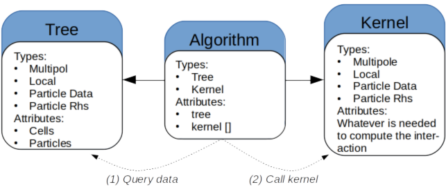

# Summary

`TBFMM` is a high-performance package that implements the parallel fast multipole method in modern `C++`.
`TBFMM` was designed with the aim of being easy to customize thanks to both `C++` templates and a fine control of the relation between the different classes of the library.
Users can implement new FMM kernels, new types of interacting elements or even new parallelization strategies.
Specifically, `TBFMM` can be used to perform research in HPC to study parallelization and scheduling approaches, but it can also be used as a simulation toolbox for scientists in physics or applied mathematics It enables users to perform simulations while delegating the data structure, the algorithm and the parallelization to the library.

# Background

The FMM [@GREENGARD1987325] has been classified as one of the most important algorithms of the 20th century [@cipra2000best].
This algorithm was originally designed to solve n-body problems, such as computing pair-wise interactions between particles.
It reduces the complexity from quadratic (N elements interact with N elements) to a quasi-linear complexity.
The central idea is to avoid computing all the interactions between the elements by approximating the interactions between elements that are far enough.
The conditions to make it possible are that the potential of the interactions to be computed must decrease with the distance, and that the kernel to approximate far interaction must exist.
In fact, providing the approximation kernels for some equations can be quite challenging. 
Internally, the FMM is usually implemented with a tree that is mapped over the simulation box.
A cell, i.e. a node of the tree, represent a part of the simulation box and is used in the algorithm to factorize the interactions between elements.
The FMM was later extended for different type of simulations with different approximation kernels [@SABARIEGO2004403,pham2012fast,sabariego2004fast,frangi2003coupled,barba2011exafmm,malhotra2015pvfmm,darve2004fast,darve2013optimizing,blanchard2016efficient,blanchard2015fast].

The FMM algorithm is described using different operators that use letters to express the type of elements they work on: `P` for particle, `M` for multipole and `L` for local.
The term particle is used for legacy reason but it represent the basic elements that interact and for which we want to approximate the interactions.
The multipole part represent the aggregation of potential, i.e. it represent what is emitted by a sub-part of the simulation box.
Whereas, the local part represent the outside that is emitted onto a sub-part of the simulation box.
The different operators are schematized in Figure \autoref{fig:fmm}.

Because it is a fundamental building blocks for many types of simulation, the FMM parallelization has been investigated.
Traditional HPC approaches composed of MPI [@10.5555/898758] or MPI together with a fork-join paradigm to parallelize over the shared memory [@bramas2016optimization].
However, it has been demonstrated that fork-join strategies are less efficient than task-based parallelization on multicore CPUs~[doi:10.1137/130915662].
This is because some part of the FMM have a small degree of parallelism, while other have high degree with a significant workload available from the beginning.
The task-based method is capable of interleaving the different operators, hence to balance the workload.
Moreover, this is even more critical on heterogeneous architecture~[doi:10.1002/cpe.3723] and distributed memory platforms [agullo:hal-01387482].
In a previous project called ScalFMM, we have provided a new hierarchical data structure called group-tree (or block-tree), which is an octree designed for the task-based method.
The two main ideas behind this container is (1) to allocated and manage several cells of the same level together (2) to split the management of symbolic data, multipole data and local data, such that each memory block can be moved anywhere on the memory and used by a task independently from the other, as illustrated in Figure \autoref{fig:blocktree}.

# Statement of need

The FMM is one of the major algorithms but it remains rare to have it included in HPC benchmarks when studying runtime systems, schedulers or optimizers.
The main reason is because it is tedious to implement and requires even more investment to implement when using the task-based method together with the group-tree.
However, it is an interesting, if not unique, algorithm to study irregular/hierarchical scientific method.

For the same reason, it is difficult to researchers in physics or applied mathematics to implement a complete FMM library - and to it efficiently - when their objectives is to focus on the study of an approximation kernel.
To be used for computer scientist to study block-based FMM and task-based parallelization (as benchmark).
From our size we will apply GPU but with the idea to remain generic.
We will also use it to study scheduling of irregular applications.

The closer existing package to `TBFMM` is  `ScalFMM`.
`ScalFMM` has around 170K lines of code, for only 50K for `TBFMM`, because it supports lots of different parallel strategies, including few ones based on the fork-join model and contains several experimental methods.
Moreover, it needs several external dependencies and does not benefit from the new standard `C++` features.
In addition, it only works for 3D problems, where `TBFMM` can work for arbitrary dimension.
However, the interface of the kernels is very similar in both libraries, such that creating a kernel for `ScalFMM` or `TBFMM` and porting it to the other library is convenient.

# Features

## Genericity

TBFMM is designed to be generic thanks to an heavy use of C++ template.
For instance, the tree and the kernel are independent from each other and from the algorithm.
The algorithm has to be templatized to the use the tree and the kernel and bridge the gap between them.
This is illustrated by the Figure X.

and referenced from text using \autoref{fig:design}

## Tree

TBFMM uses the block-tree (also called group-tree) where cells of the same level are managed together.
This has been shown that it is well designed for the task-based parallelization including
TBFMM also provides a simple heuristic to find a bloc-size automatically that will allow for obtaining efficient executions.
It is also possible to iterate on the cells/leaves of the tree.

## Kernel

One of the main objective of TBFMM is to provide a tool for scientist from physics and applied mathematics to create new kernels.
Therefore, TBFMM offer an easy way to customize the kernel.
The parallelization is then automatic and independent of the underlying parallelization engine.

## Parallelization

TBFMM currently use two task-based runtime systems.
It uses OpenMP tasks version 4.5 [@openmp4].
It is ready to benefit from the new `mutexinout` from OpenMP 5.
It also uses Spetabaru, which is a runtime system used for research to study scheduling, task-based programming and speculative execution.
It supports commute data access.

[@10.7717/peerj-cs.183]

## Periodicity

The periodicity consists in considering that the simulation box is repeated unlimited in all direction.
To compute the potential of the periodic box over the simulation, it is classic to use the X approach.
In TBFMM we have implemented a different approach, which is a pure algorithmic strategy [cite].
The idea is to consider that the the FMM is a sub-part of a more larger tree.
Then, instead of stopping the algorithm up to level 2, we continue up to the root where the multipole part of the root represent the complete simulation box.
We use it by continuing the FMM algorithm partially above the root.
By doing so, we have several advantages.
The method needs nothing more than a FMM kernel (the same as the one use without periodicity).
The accuracy relies on the FMM kernel.
The method is generic.

and referenced from text using \autoref{fig:periodicfmm}

[@bramas2016optimization]

## Vectorization (Inastemp)

[@bramas2017inastemp]

# Performance

Example of performance

and referenced from text using \autoref{fig:performance}

# Conclusion & Perspective

# Acknowledgements

.

# References
