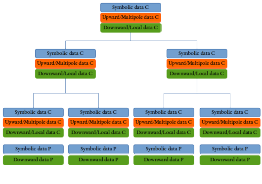

# Summary

`TBFMM`, for task-based FMM, is a high-performance package that implements the parallel fast multipole method (FMM) in modern `C++17`. 
It implements parallel strategies for multicore architectures, i.e. to run on a single computing node.
`TBFMM` was designed to be easily customized thanks to `C++` templates and fine control of the `C++` classes' inter-dependencies.
Users can implement new FMM kernels, new types of interacting elements or even new parallelization strategies.
As such, it can be used as a simulation toolbox for scientists in physics or applied mathematics.
It enables users to perform simulations while delegating the data structure, the algorithm and the parallelization to the library.
Besides, `TBFMM` can also provide an interesting use case for the HPC research community regarding parallelization, optimization and scheduling of applications handling irregular data structures.

# Background

The fast multipole method [@GREENGARD1987325] has been classified as one of the most important algorithms of the 20th century [@cipra2000best].
The FMM algorithm was designed to compute pair-wise interactions between `N` particles, which belong to the class of n-body problems.
It reduces the complexity from a quadratic (`N` elements interact with `N` elements) to a quasi-linear complexity.
The central idea of the FMM is to avoid computing the interactions between all the elements by approximating the interactions between elements that are far enough.
To make this possible, the algorithm requires the potential of the interactions to decrease as the distance between interacting elements increases.
The algorithm also requires that the kernel to approximate far interactions exists; providing an approximation kernel for a physical equation can be challenging. 
Internally, the FMM is usually implemented with a tree that is mapped over the simulation box.
A cell, i.e. a node of the tree, represents a part of the simulation box and is used by the algorithm to factorize the interactions between elements.
The FMM was later extended for different types of physical simulations and different approximation kernels [@SABARIEGO2004403;@pham2012fast;@sabariego2004fast;@frangi2003coupled;@barba2011exafmm;@malhotra2015pvfmm;@darve2004fast;@darve2013optimizing;@blanchard2016efficient;@blanchard2015fast].

The FMM algorithm is based on six operators with names that respect the format `X2Y`, where `X` represents the source of the operator and `Y` the destination.
The operators are `P2M`, `M2M`, `M2L`, `L2L`, `L2P` and `P2P`, where `P` means particle, `M` multipole and `L` local.
The term particle is used for a legacy reason, but it represents the basic interaction elements that interact and for which we want to approximate the interactions.
The multipole part represents the aggregation of potential, i.e. it represents what is emitted by a sub-part of the simulation box, whereas the local part represents the outside that is emitted onto a sub-part of the simulation box.
The different operators are schematized in \autoref{fig:fmm}.

Because the FMM is a fundamental building block for many types of simulation, its parallelization has already been investigated.
Some strategies for parallelizing over multiple distributed memory nodes have been developed using classical HPC technologies like `MPI` [@10.5555/898758] and fork-join threaded libraries [@bramas2016optimization].
Using these technologies, different projects have created FMM implementations that scale on thousands of computing nodes [@6375552;@malhotra2015pvfmm;@doi:10.1137/18M1173599].
However, when using a single node, it has been demonstrated that fork-join schemes are less efficient than task-based parallelization on multicore CPUs [@doi:10.1137/130915662].
This is because some stages of the FMM have a small degree of parallelism (for instance at the top of the tree), while others have a high degree of parallelism.
For instance, the `P2P` in the direct pass has a significant workload available from the early beginning of each iteration.
The task-based method can interleave the different operators, hence to balance the workload across the processing units and to spread the critical parts over time.
Moreover, the task-based method is well designed for handling heterogeneous architecture [@doi:10.1002/cpe.3723] and has demonstrated a promising performance on distributed memory platforms too [@agullo:hal-01387482].

In a previous project called `ScalFMM`, we have provided a new hierarchical data structure called group-tree (or block-tree), which is an octree designed for the task-based method [@bramas2016optimization].
The two main ideas behind this container are (1) to allocate and manage several cells of the same level together to control the granularity of the tasks, and (2) to store the symbolic data, the multipole data, and the local data in a different memory blocks.
This allows us to move each block anywhere on the memory nodes and to declare the dependencies on each sub-part.

A schematic view of the group-tree is given in \autoref{fig:blocktree}.

# Statement of need

The FMM is a major algorithm but it remains rare to have it included in HPC benchmarks when studying runtime systems, schedulers or optimizers.
The principal reason is that it is tedious to implement and requires a significant programming effort when using the task-based method together with the group-tree.
However, it is an interesting, if not unique, algorithm to study irregular/hierarchical scientific method.
For the same reason, it is difficult for researchers in physics or applied mathematics to implement a complete FMM library and to optimize it for modern hardware, especially if their aim is to focus on approximation kernels.
Therefore, `TBFMM` can be useful for both communities.

Among the few existing FMM libraries, `ScalFMM` is the closer package to `TBFMM`.
`ScalFMM` supports lots of different parallel strategies, including fork-join implementations, and it contains several experimental methods.
Consequently, `ScalFMM` has around 170K lines of code, for only 50K for `TBFMM`.
Moreover, it needs several external dependencies and does not benefit from the new standard `C++` features that could improve code readability.
Besides, it only works for 3D problems, whereas `TBFMM`'s tree and algorithms supports any number of dimensions.
These have been the main motivations to re-implement a lightweight FMM library from scratch that only supports task-based parallelization.

However, the interface of the kernels is very similar in both libraries, such that creating a kernel for `ScalFMM` or `TBFMM` and porting it to the other library is straightforward.

`FMMTL` [@10.1007/978-3-319-10705-9_60] is another existing FMM library with a generic `C++` design.
Similar to `TBFMM`, `FMMTL` works with various types of kernels.
However, it relies on a fork-join parallelization strategy on top of `OpenMP` and on the `Thrust` library to support GPUs.
While this approach is elegant and makes the code clean, it is also more complex to fine tune the scheduling, the load balancing, and the data movement.

# Features

## Genericity

`TBFMM` has a generic design thanks to the heavy use of `C++` templates.
Users must provide arguments for the various template parameters of the main classes.
The tree and the kernel classes are independent of each other and from the algorithm.
The algorithm class needs the type of the kernel as a template argument, and its core `execute`  method has to be templatized with the type of the tree. 
The algorithm takes the elements from the tree and passes them to the kernel, such that a kernel itself never accesses the tree.
This is illustrated by \autoref{fig:design}.

## Tree

`TBFMM` uses the group-tree where several cells of the same level are managed together.
Users can select the size of the groups, which impacts the size of the tasks, however, `TBFMM` also provides a simple heuristic to automatically find a size that should provide efficient executions.
Also, the tree class provides different methods to iterate on the cells/leaves as any container, such that it is possible to work on the elements of the tree with an abstraction mechanism and without knowing how it is implemented internally.

## Kernel

As stated in the objectives, `TBFMM` is a tool for scientists from physics and applied mathematics to create new kernels.
`TBFMM` offers a convenient way to customize the kernel and to benefit from the underlying parallelization engine automatically.
With this aim, a user has to create a new kernel that respects an interface, as described by the package documentation.
The current package contains two FMM kernels, the `rotation` kernel based on the rotation-based operators and the spherical harmonics [@doi:10.1063/1.2194548;@doi:10.1063/1.468354;@doi:10.1063/1.472369;@haigh2011implementation], and the `uniform` kernel based on Lagrange interpolation [@blanchard2015fast;@blanchard2015hierarchical;@blanchard2016efficient].

## Parallelization

`TBFMM` has two  task-based parallel algorithms based on two runtime systems: `OpenMP` version 4 [@openmp4] and `SPETABARU` [@10.7717/peerj-cs.183]. 
Both are optional, such that the library can be compiled even if the compiler does not support `OpenMP` or if the `Git` sub-module for `SPETABARU` has not been activated.
`OpenMP` is an API that evolves slowly, which maintains backward compatibility and which is implemented by different libraries that respect the standard.
On the other hand, `SPETABARU` is our task-based runtime system that we use for research, and which continuously evolves.
The data accesses of the FMM operators in `write` are usually commutative [@7912335].
While `SPETABARU` supports commutative `write` access, `OpenMP` only supports it from version 5 with the `mutexinout` data access.
`OpenMP` version 5 is currently not fully supported by the compilers, however, when a compiler that supports this access will be used with `TBFMM`, the `mutexinout` will be activated automatically.

## Periodicity

The periodicity consists of considering that the simulation box is repeated in all directions, as shown by \autoref{fig:periodicillu}.
Computing the FMM algorithm with periodicity is usually done in two steps.
In the first one, the regular algorithm and tree are used.
When the algorithm needs cells outside of the boundaries, it selects cells at the opposite side of the simulation box.
While in the second step, a numerical model is used to compute a potential that represents the world outside the simulation box.
Such a model could be the Ewald summation [@407723].

In `TBFMM`, we have implemented a different approach, which is a pure algorithmic strategy [@bramas2016optimization].
The idea is to consider that the real simulation box is a sub-part of a larger simulation box, i.e. that the real tree is a branch of a larger tree.
Then, instead of stopping the FMM algorithm at level 2, we continue up until the root where the multipole part of the root represents the complete simulation box.
We use it by continuing the FMM algorithm partially above the root, by aggregating the cells together multiple times.
By doing so, we have several advantages.
This method needs nothing more than an FMM kernel, which is expected to be the same as the one used without periodicity.
Therefore, the method is generic and can work with any FMM kernel.
Moreover, the accuracy of the method relies fully on the FMM kernel. 
\autoref{fig:periodicmerge} shows how the simulation box is repeated with this method.

## Vectorization (Inastemp)

When implementing a kernel, some parts can rely on well-optimized numerical libraries, such as BLAS or FFTW, however, others might be implemented directly in `C/C++`.
In this case, it usually provides a significant improvement in performance to vectorize the code, which allows benefiting from the SIMD capability of modern CPUs.
With this aim, `TBFMM` can include a vectorization library called `Inastemp` [@bramas2017inastemp] by simply cloning the corresponding `Git` sub-module.
Using `Inastemp`, it is possible to write a single code with an abstract vector data type and to select at compile time the desired instruction set depending on the CPU (`SSE`, `AVX`, `SVE`, etc.).
In the current version of `TBFMM`,  the `P2P` operator of the two kernels that are provided for demonstration is vectorized with `Inastemp`.

# Performance

In \autoref{fig:performance}, we provide the parallel efficiency of `TBFMM` for a set of particles that are randomly distributed in a square simulation box.
The given results have been computed using the `uniform` kernel and the two runtime systems OpenMP (GNU libomp) and SPETABARU.
Both implementation are similar; they use the same input data, the same tasks, the same priorities. 
The only differences are coming from the implementation of the runtime systems, which impact the overhead, and the type of data access they support.
We recall that OpenMP 4.5 does not support `mutexinout` for commutative data access.
In our case, the resulting degree of parallelism is then too limited to feed all the available cores. 
This is already a problem with 2 threads, and there is even no reduction in the execution time with more than 8 threads, which appears as a significant drop in the parallel efficiency.
Even so, we believe that it would be possible to improve our OpenMP-based implementation by inserting the tasks differently.
Instead, we will wait that the OpenMP library implementations support `mutexinout`.

# Conclusion & Perspective

`TBFMM` is a lightweight FMM library that could be used for research in HPC and applied mathematics.
We will include it in our benchmarks to evaluate scheduling strategies, but also to validate new approaches to develop numerical applications on heterogeneous computing nodes.
Indeed, we would like to offer an elegant way for users to add GPU kernels while delegating most of the complexity to `TBFMM` and `SPETABARU`.
We also plan to provide an `MPI` version to support distributed memory parallelization shortly.

# Acknowledgements

Acknowledgment: Experiments presented in this paper were carried out using the PlaFRIM experimental testbed, supported by Inria, CNRS (LABRI and IMB), Université de Bordeaux, Bordeaux INP and Conseil Régional d'Aquitaine.

# References
